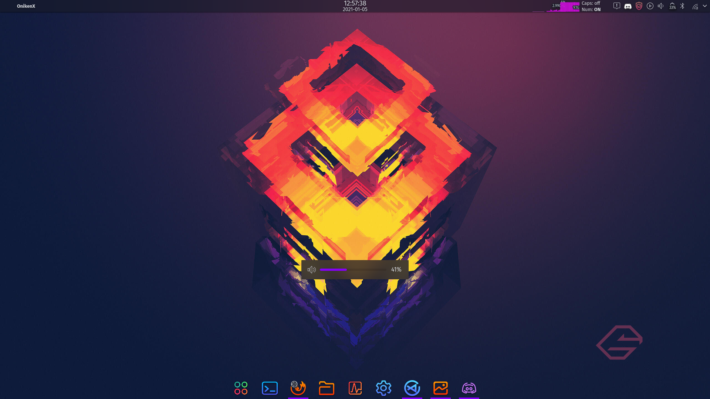

# KDE-OSD

### Thanks:
my thanks for Koneko-Nyaa for creating this post:
sources: https://www.reddit.com/r/kde/comments/9j57z2/fixing_the_awful_volumebrightness_osd_size/

## Introduction:

KDE-OSD-Stealth puts the osd (the audio, microfone and brightness slider in the middle of the screen) in the left inferior conner.

### Original: 


### OSD-Stealth:


## Installation:

To install in  ArchLinux with pacman hooks an PKGBUILD can be found in the releases, install with:
```pacman -U <package_name>```

- For a general installation you can install it with:
```bash
curl https://raw.githubusercontent.com/OnikenX/KDE-OSD-stealth/5.20%2B/INSTALL | sudo bash
```

- To remove the general installation:x
```bash
curl https://raw.githubusercontent.com/OnikenX/KDE-OSD-stealth/5.20%2B/UNINSTALL | sudo bash
``` 